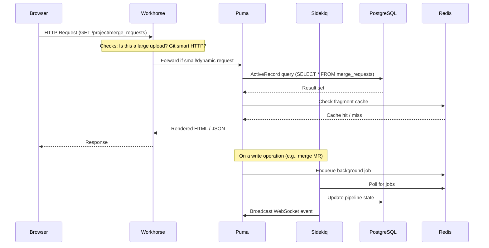
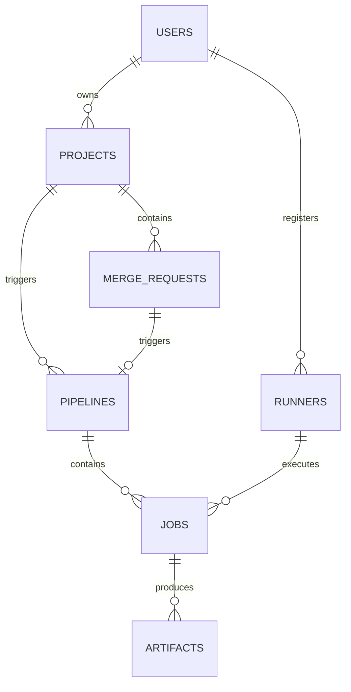
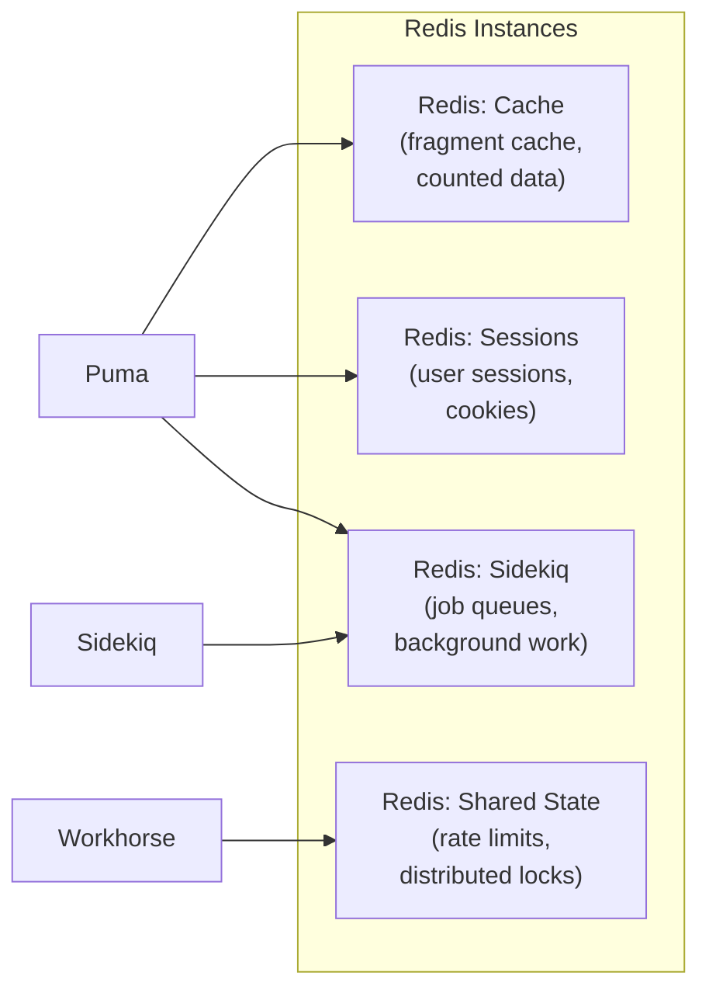
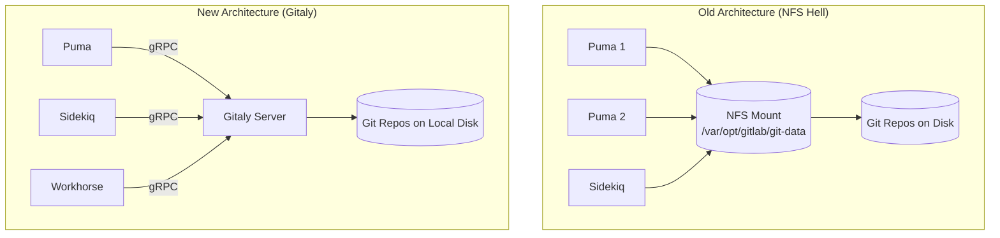
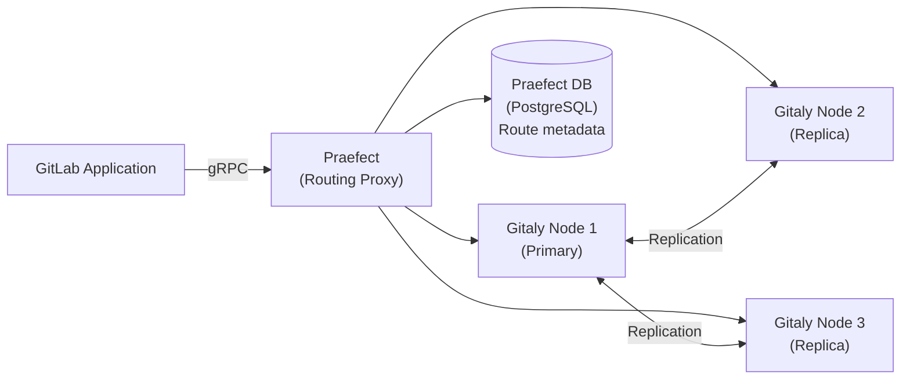
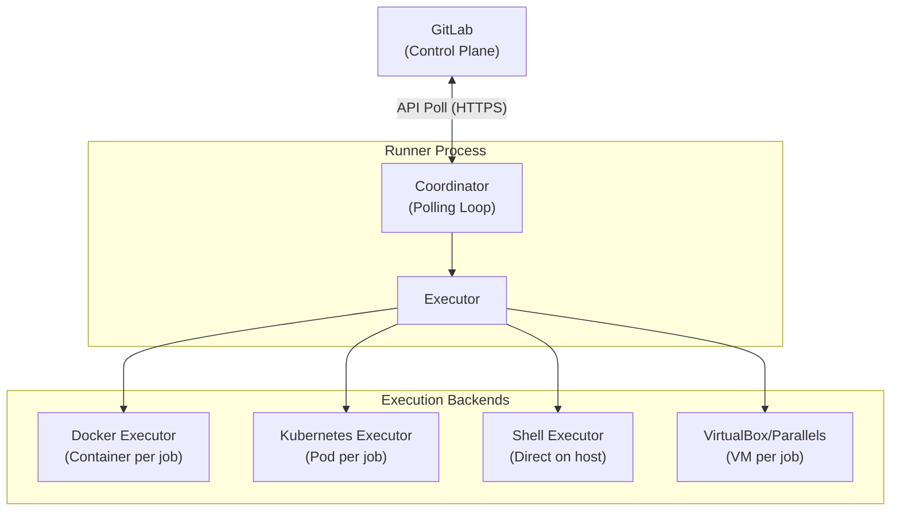
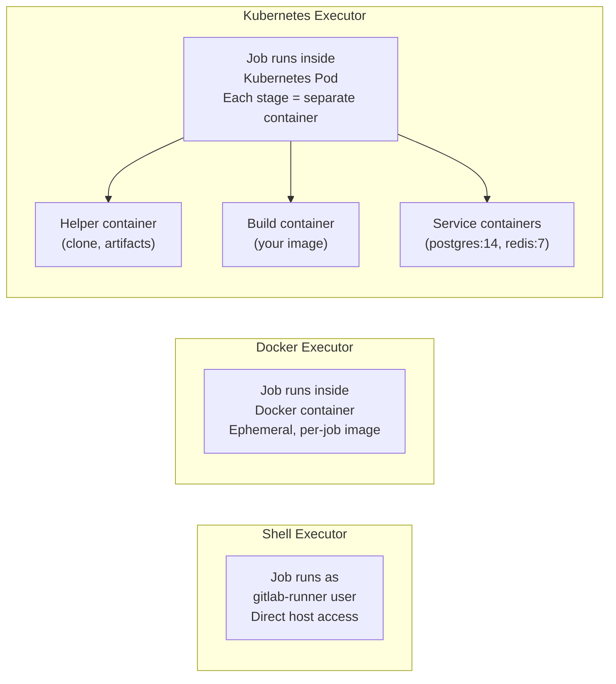
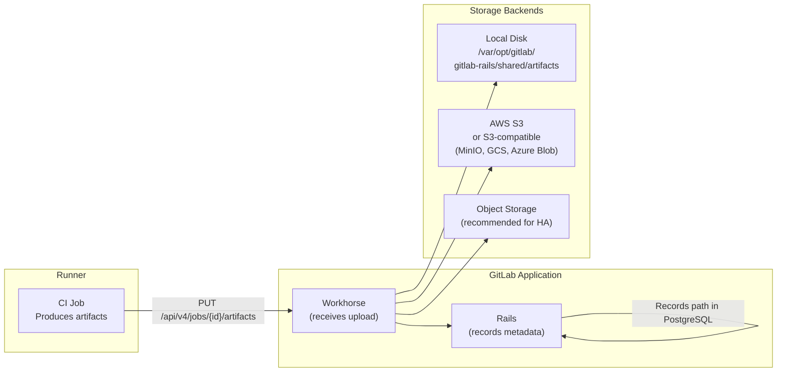
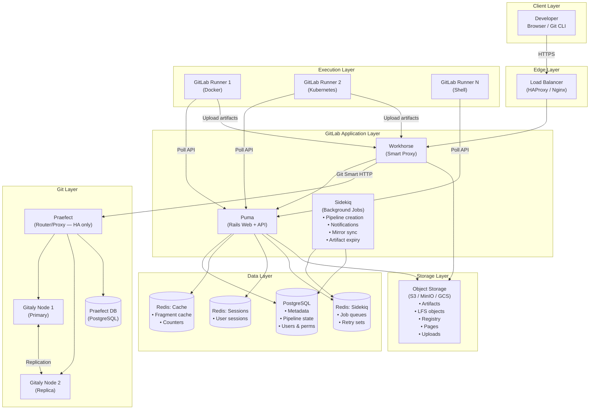
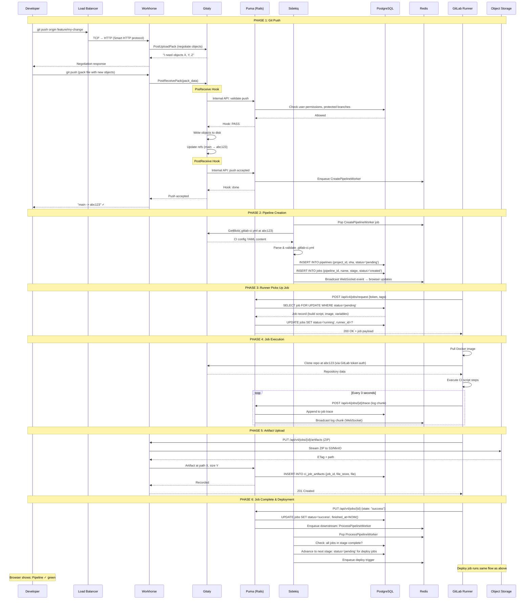

# Module 3 — GitLab Architecture Deep Dive

> **Teaching Philosophy:** Every component exists because something else was intolerably painful.  
> We follow: **Pain → Root Cause → Mechanism → Trade-off → Failure Mode**

---

## Table of Contents

1. [The Core Mechanism Statement](#1-the-core-mechanism-statement)
2. [GitLab Application Layer](#2-gitlab-application-layer)
3. [PostgreSQL — The Source of Truth](#3-postgresql--the-source-of-truth)
4. [Redis — The Speed Layer](#4-redis--the-speed-layer)
5. [Gitaly — The Git Execution Engine](#5-gitaly--the-git-execution-engine)
6. [GitLab Runner — The Execution Plane](#6-gitlab-runner--the-execution-plane)
7. [Artifact Storage — The Evidence Vault](#7-artifact-storage--the-evidence-vault)
8. [Full System Architecture Diagram](#8-full-system-architecture-diagram)
9. [Request Flow: Developer Commit → Deployment](#9-request-flow-developer-commit--deployment)
10. [Internal Workflow — Phase-by-Phase](#10-internal-workflow--phase-by-phase)
11. [Failure Mode Matrix](#11-failure-mode-matrix)
12. [Prediction Questions (L2/L3/L4)](#12-prediction-questions-l2l3l4)

---

## 1. The Core Mechanism Statement

Before we open any component, anchor this mental model:

> **GitLab is an event-driven state machine.**  
> Every developer action produces an **event** → events mutate **state** (in PostgreSQL) → state changes trigger **side effects** (pipelines, notifications, deployments) → side effects produce **evidence** (artifacts, logs, metrics).

Every component below exists to own a specific slice of that pipeline.

```
Event ──► State Change ──► Side Effect ──► Evidence
  │              │               │              │
(Git push)  (PostgreSQL)    (Runner job)   (Artifacts)
(API call)   (Redis cache)  (Gitaly write)  (Registry)
```

---

## 2. GitLab Application Layer

### Pain First

Before GitLab, teams managed:
- **Git hosting** on a bare server (no UI, no access control)
- **CI/CD** on a separate Jenkins instance
- **Issue tracking** on Jira (separate login, separate data)
- **Code review** as email threads

Four separate systems. Four authentication systems. Zero shared context.

### Root Cause

Toolchain fragmentation. A merge request in one system had no mechanical link to the issue that created it, the pipeline that validated it, or the deployment that delivered it. Every "link" was a human with copy-pasted IDs.

### What GitLab Application Actually Is

The GitLab Application is **not one thing**. It is a monolith composed of three runtimes that all share the same Rails codebase:

| Process Name | Role | Protocol |
|---|---|---|
| `puma` | Web server — serves the browser UI and REST API | HTTP/HTTPS |
| `sidekiq` | Background job processor — handles async work | Redis queue |
| `workhorse` | Smart reverse proxy — offloads large I/O from Puma | Sits in front of Puma |

### Mechanism: The Request Path Through the Application



### Why Workhorse Exists (Critical Detail Most Engineers Miss)

**Without Workhorse:**  
A `git push` uploads a 500 MB pack file. Puma's thread is blocked for the entire duration of the upload — it cannot serve any other requests. With 4 Puma workers, 4 large pushes bring your entire GitLab instance to a halt.

**With Workhorse:**  
Workhorse buffers the entire upload to disk or object storage **before** passing anything to Puma. Puma receives a lightweight notification: "Upload complete, it's at this path." Puma threads stay free.

```
Without Workhorse:  Browser ──────[500MB upload]──────► Puma (BLOCKED 30s)
With Workhorse:     Browser ──────[500MB upload]──────► Workhorse (buffer)
                                                              │
                                                         [Done: "file at /tmp/upload"]
                                                              │
                                                          Puma (handles in <10ms)
```

### Trade-offs

| Decision | Benefit | Cost |
|---|---|---|
| Rails monolith | Shared database schema, easy feature development | Difficult to scale individual components |
| Sidekiq for async | Simple job queue, Redis-backed | Jobs are not durable across Redis restarts without persistence |
| Puma thread model | Handles concurrent requests | High memory per thread under Ruby's GIL |

### Failure Modes

- **Sidekiq queue backup**: If Sidekiq workers are too few, jobs pile up in Redis. Pipelines appear to "not start" — they're queued, not stuck.
- **Puma timeout on large repos**: A `git log` on a 10GB repo without Gitaly optimizations will timeout Puma's 60s limit.
- **Workhorse disk exhaustion**: If `/tmp` fills up during a large push, Workhorse drops the upload silently. The developer sees a generic error.

---

## 3. PostgreSQL — The Source of Truth

### Pain First

Before structured storage, GitLab could have used flat files or SQLite. At scale, a `SELECT * FROM pipelines WHERE project_id = 123` on flat files is a full scan of millions of records. At 100 concurrent requests, your server dies.

### Root Cause

GitLab data is **relational by nature**: Users own Projects. Projects have MergeRequests. MergeRequests trigger Pipelines. Pipelines have Jobs. Jobs produce Artifacts. These foreign-key relationships require a RDBMS to be query-efficient.

### What PostgreSQL Stores (and What It Doesn't)

**PostgreSQL IS the source of truth for:**
- Users, groups, permissions, roles
- Projects, repositories (metadata only, not the files)
- Issues, merge requests, comments, labels, milestones
- Pipeline definitions, job records, statuses
- CI/CD variables, runner registrations
- Audit logs, deploy tokens, access tokens (hashed)

**PostgreSQL is NOT used for:**
- Actual Git objects (those live in Gitaly)
- Session data (that's Redis)
- Binary artifacts (that's Object Storage)
- Cache data (that's Redis)



### Mechanism: How GitLab Writes Pipeline State

When a pipeline job transitions from `pending` → `running` → `success`:

```
1. Runner polls GitLab API: "Give me a job"
2. Puma: SELECT * FROM jobs WHERE status = 'pending' AND runner_id IN (...) LIMIT 1 FOR UPDATE
   [ADVISORY LOCK prevents two runners grabbing the same job]
3. Puma: UPDATE jobs SET status = 'running', started_at = NOW() WHERE id = ?
4. Puma: INSERT INTO events (action, target_type, target_id) VALUES ('running', 'Job', ?)
5. Sidekiq picks up the event → broadcasts to WebSocket → your browser updates in real-time
```

The `FOR UPDATE` pessimistic lock is why two runners never grab the same job. This is a critical correctness guarantee.

### Trade-offs

| Decision | Benefit | Cost |
|---|---|---|
| PostgreSQL only (no MySQL) | Advanced features: JSONB, advisory locks, full-text search | Harder to self-host on managed MySQL |
| JSONB for CI config | Schema-flexible, queryable | Harder to index deeply nested keys |
| Connection pooling via PgBouncer | Reduces PostgreSQL connection overhead | Adds latency; PgBouncer is a SPOF |

### Failure Modes

- **Table bloat on `ci_builds`**: This table can reach 100M+ rows. Without partitioning and regular `VACUUM`, query plans degrade.
- **Lock contention under high concurrency**: Thousands of runners polling simultaneously cause lock wait queues. Symptom: jobs queue but never start despite idle runners.
- **Checkpoint storms**: Aggressive write load causes PostgreSQL WAL to flush in bursts, causing latency spikes. Tune `checkpoint_completion_target = 0.9`.

---

## 4. Redis — The Speed Layer

### Pain First

Every time you view a GitLab page, it could recalculate: "How many open issues does this project have?" A SQL COUNT(*) on a large project with 50,000 issues, done 1,000 times per second, would collapse PostgreSQL instantly.

### Root Cause

Some data is **read-heavy but write-rarely**. PostgreSQL is optimized for durable writes — it fsync's to disk on every commit. For ephemeral, frequently-read data, that durability is overhead you don't need.

### What Redis Actually Handles in GitLab

GitLab uses **multiple Redis instances** (in modern deployments), each with a distinct role:



| Redis Role | Data Stored | TTL |
|---|---|---|
| **Cache** | View fragments, query results, issue counts | Minutes to hours |
| **Sidekiq** | Job payloads, retry queues, dead queues | Until processed |
| **Sessions** | `_gitlab_session` cookie data | 2 weeks (configurable) |
| **Shared State** | Rate limit counters, distributed locks, WebSocket pub/sub | Seconds |

### Mechanism: The Sidekiq Queue Model

Sidekiq uses Redis as a persistent queue. Every background operation (sending email, creating pipeline, syncing mirrors) is:

```
1. Puma: LPUSH sidekiq:queue:default '{"class":"CreatePipelineWorker","args":[123]}'
2. Sidekiq polls: BRPOP sidekiq:queue:default 0  [blocking pop]
3. Sidekiq deserializes job
4. Sidekiq executes CreatePipelineWorker.new.perform(123)
5. On failure: job moved to retry set with exponential backoff
6. After max retries: moved to dead set
```

The retry mechanism uses Redis Sorted Sets (`ZADD sidekiq:retry <score=retry_at_timestamp> <job>`) — this is why Sidekiq can retry jobs at precise future times.

### Mechanism: Rate Limiting via Redis

```
User hits /api/v4/projects — Workhorse checks:
  INCR rate_limit:user:456:GET:/api/v4/projects
  EXPIRE rate_limit:user:456:GET:/api/v4/projects 60
  if result > 600: return 429 Too Many Requests
```

The counter auto-expires after 60 seconds. Redis's atomic INCR prevents race conditions between concurrent requests.

### Trade-offs

| Decision | Benefit | Cost |
|---|---|---|
| In-memory storage | Microsecond latency | Data lost on restart (unless RDB/AOF enabled) |
| Single-threaded event loop | No lock overhead, predictable latency | CPU-bound operations block everything |
| Separate Redis instances | Failure isolation (Sidekiq down ≠ Sessions down) | More operational complexity |

### Failure Modes

- **Redis OOM (Out of Memory)**: If `maxmemory` is not set and cache fills RAM, Redis kills jobs or crashes. Set `maxmemory-policy allkeys-lru` for cache instances.
- **Sidekiq queue depth explosion**: If workers die, jobs pile up. 1M jobs in queue = Redis memory explosion. Monitor `sidekiq_queue_size`.
- **Session loss on Redis restart without AOF**: All users are logged out simultaneously. Never run session Redis without persistence.

---

## 5. Gitaly — The Git Execution Engine

### Pain First

Before Gitaly (pre-2018), every GitLab process that needed Git data would shell out to the `git` binary directly on the filesystem. At 10 GitLab instances (for HA), all 10 needed **direct NFS access** to the same repository storage.

NFS + Git = production disaster:
- NFS file locking is broken for Git's pack files
- Network latency multiplied every `git` syscall
- GitLab Engineering measured: **NFS was causing 50% of all production incidents**

### Root Cause

Git was designed as a local tool. Its file format assumes local disk access with OS-level locking. Sharing Git repositories over a network filesystem violates that assumption at every layer.

### What Gitaly Is

Gitaly is a **gRPC server** that owns all Git operations. It is the only process that ever touches the Git repository files on disk. Every other GitLab component communicates with Gitaly over the network using Protocol Buffers.



### Gitaly's RPC Surface

Gitaly exposes ~100 RPCs. Categories:

| Category | Example RPCs | What They Do |
|---|---|---|
| **Repository** | `CreateRepository`, `DeleteRepository` | Lifecycle of repo |
| **Commit** | `ListCommits`, `GetCommit`, `CommitDiff` | Read commit history |
| **Ref** | `ListRefs`, `FindBranch` | List/resolve refs |
| **Tree** | `GetTreeEntries`, `GetBlob` | Navigate file tree |
| **Smart HTTP** | `PostReceivePack`, `PostUploadPack` | Git push/pull protocol |
| **Hook** | `PreReceive`, `PostReceive` | Execute Git hooks |

### Mechanism: What Happens on `git push`

```
1. Developer: git push origin main
2. SSH daemon / HTTP → Workhorse
3. Workhorse: calls Gitaly.PostReceivePack(repo, pack_data)
4. Gitaly:
   a. Writes incoming pack file to temp location
   b. Verifies pack integrity (git index-pack)
   c. Runs PreReceive hook (calls back to GitLab Rails via internal API)
      → GitLab checks: Does this user have push access?
      → GitLab checks: Does this violate protected branch rules?
   d. If hook passes: moves pack into repository's object store
   e. Updates refs (main → new commit hash)
   f. Runs PostReceive hook
      → GitLab: Creates MergeRequest if branch pattern matches
      → GitLab: Enqueues pipeline creation job in Sidekiq
5. Gitaly returns: "Push accepted"
6. Workhorse returns success to developer
```

### Gitaly Cluster (High Availability)

In HA setups, Praefect acts as a routing proxy in front of multiple Gitaly nodes:



Praefect uses a separate PostgreSQL database to track which Gitaly node is the primary and whether replicas are in sync.

### Trade-offs

| Decision | Benefit | Cost |
|---|---|---|
| gRPC over NFS | Eliminates NFS locking bugs | Network hop for every Git operation |
| Gitaly owns disk | Single point of disk access | Gitaly process crash = all repos inaccessible |
| Praefect replication | HA for repository data | Replication lag; split-brain risk |

### Failure Modes

- **Gitaly process crash**: All Git operations fail immediately. GitLab shows "Repository not available" errors. Puma does not fail gracefully — requests queue up.
- **Disk full on Gitaly node**: `PostReceivePack` fails mid-push. Repository can be left in a corrupted state if pack write is incomplete.
- **Praefect out of sync**: If a replica falls behind and Praefect promotes it to primary, you lose commits. Monitor `gitaly_praefect_replication_queue_depth`.

---

## 6. GitLab Runner — The Execution Plane

### Pain First

GitLab knows **what** to run (the `.gitlab-ci.yml` file). But it has no idea **where** to run it. Should jobs run inside GitLab's own servers? That would mean arbitrary user code executing next to GitLab's own database — a catastrophic security model.

### Root Cause

Execution environment must be **isolated from the control plane**. The component that runs CI/CD jobs must be:
- Physically separate from GitLab (different servers, different network)
- Able to run on any infrastructure (cloud VMs, Kubernetes, bare metal)
- Capable of different isolation models (containers, VMs, processes)

### What GitLab Runner Is

GitLab Runner is a **polling agent** that:
1. Registers with GitLab (gets a token)
2. Polls GitLab's API for pending jobs
3. Claims a job
4. Executes the job in the configured executor
5. Streams logs back to GitLab in real-time
6. Uploads artifacts on completion



### Mechanism: The Job Polling Loop

Runner does not receive webhooks. It **polls**. This is a deliberate security decision — Runner only makes outbound connections, so it can live behind a firewall with no inbound ports open.

```
Every N seconds (configurable, default 3s):
  Runner → POST /api/v4/jobs/request
  Body: { "token": "runner-token", "last_update": "etag" }

  GitLab: Check for pending jobs matching this runner's tags
  
  Case 1 — No jobs:
    Response: 204 No Content
    Runner: wait interval, try again
  
  Case 2 — Job available:
    Response: 200 + job payload (script, image, variables, services)
    Runner: BEGIN EXECUTION
      1. Prepare environment (pull Docker image / create pod)
      2. Clone repository via Gitaly (uses job token for auth)
      3. Execute each `script` step
      4. Stream logs: POST /api/v4/jobs/{id}/trace  [chunked, every 3s]
      5. Upload artifacts: PUT /api/v4/jobs/{id}/artifacts
      6. Report final status: PUT /api/v4/jobs/{id}  {state: "success"|"failed"}
```

### Executor Isolation Model Comparison



| Executor | Isolation | Speed | Use Case |
|---|---|---|---|
| Shell | None (host-level) | Fastest | Trusted, controlled environments |
| Docker | Container | Fast | General CI, most common |
| Kubernetes | Pod | Medium (pod spin-up) | Cloud-native, auto-scaling |
| VM | Full VM | Slow | Security-critical, iOS builds |

### Trade-offs

| Decision | Benefit | Cost |
|---|---|---|
| Polling vs webhook | Runner behind firewall, no inbound ports | Poll interval = minimum job latency |
| Stateless runner | Easy to scale horizontally | No shared state between jobs by default |
| Token-based registration | Simple auth model | Compromised runner token = job data exposure |

### Failure Modes

- **Runner timeout on long jobs**: Default job timeout is 60 minutes. A compile job that takes 61 minutes fails. Set `timeout` in `.gitlab-ci.yml`.
- **Docker socket exposure**: Shell executor with Docker-in-Docker and `--privileged` flag = root on the host. Never run on shared infrastructure.
- **Runner offline between job claim and execution**: If runner crashes after claiming a job but before reporting status, GitLab marks the job as stuck after `stuck_jobs_timeout` (default 1 hour).

---

## 7. Artifact Storage — The Evidence Vault

### Pain First

A CI pipeline produces 200 MB of test reports, binaries, and coverage data. If those files live on the GitLab server's disk:
- One disk fills up and breaks **all** pipelines for **all** projects
- You can't scale GitLab horizontally (artifacts aren't replicated across nodes)
- Deleting old artifacts requires manual scripts

### Root Cause

Binary large objects (BLOBs) are the wrong fit for a relational database and a bad fit for local disk in a multi-node system. They need a **content-addressed, durable, horizontally scalable** storage system.

### What Artifact Storage Is

GitLab supports multiple artifact storage backends:



### What Gets Stored as Artifacts

| Artifact Type | Stored Where | Notes |
|---|---|---|
| Job artifacts (ZIP) | Object Storage | Generic files from `artifacts: paths:` |
| JUnit XML reports | Object Storage + PostgreSQL (parsed) | Test results shown in MR UI |
| Coverage reports | Object Storage + PostgreSQL (parsed) | Coverage percentage in MR |
| Container images | Registry (separate service) | Docker images from `docker push` |
| Pages sites | Object Storage | Static sites from `pages:` jobs |
| Terraform state | PostgreSQL | Small, structured — lives in DB |

### Mechanism: The Artifact Upload Flow

```
1. Runner job completes
2. Runner: reads artifacts from filesystem (ZIP compression)
3. Runner: PUT /api/v4/jobs/{id}/artifacts
   Headers: JOB-TOKEN: <token>
   Body: multipart/form-data with ZIP file

4. Workhorse: intercepts, streams to object storage directly
   [does NOT pass large binary through Puma]

5. Workhorse → Puma: "Upload complete, ETag: abc123, path: uploads/..."

6. Puma → PostgreSQL: INSERT INTO ci_job_artifacts
   (job_id, file_type, size, file_store, file)
   VALUES (456, 1, 204800, 2, 'artifacts/2024/01/job-456.zip')

7. Artifact is now accessible via:
   GET /api/v4/jobs/{id}/artifacts  → Workhorse fetches from object storage
```

### Artifact Expiry and Lifecycle

GitLab uses a background Sidekiq job `ExpireJobArtifactsWorker`:

```
Runs every hour:
  SELECT * FROM ci_job_artifacts 
  WHERE expire_at < NOW() AND file_store IS NOT NULL
  LIMIT 1000

For each expired artifact:
  1. Delete from object storage
  2. UPDATE ci_job_artifacts SET file = NULL
  3. If keep_latest_artifact is true: skip deletion for latest successful job
```

### Trade-offs

| Decision | Benefit | Cost |
|---|---|---|
| Object storage (S3) | Infinite scale, no disk management | Egress costs; network latency on download |
| Local disk | Zero egress cost, low latency | Tied to one node; no HA |
| Workhorse direct-to-S3 | Puma not blocked by large uploads | Complex presigned URL flow |

### Failure Modes

- **Object storage credentials expire**: Artifacts suddenly 404. Symptom: "Artifact not found" with no server errors in GitLab log. Check Workhorse log for S3 auth errors.
- **Artifact expiry not cleaning up**: If `ExpireJobArtifactsWorker` is backed up in Sidekiq, disk or object storage fills up. Monitor `ci_job_artifacts` table row count.
- **Artifact download timeout on large files**: GitLab's default Nginx timeout (300s) will cut off 2GB artifact downloads. Tune `proxy_read_timeout`.

---

## 8. Full System Architecture Diagram



---

## 9. Request Flow: Developer Commit → Deployment

This is the complete **end-to-end lifecycle** of a single commit through the GitLab system.



---

## 10. Internal Workflow — Phase-by-Phase

### Phase 1: Git Push — What Actually Happens in 200ms

```
t=0ms    Developer runs: git push origin main
t=5ms    SSH/HTTP connection established to GitLab
t=10ms   Workhorse receives connection
t=15ms   Workhorse calls Gitaly.InfoRefs() — "what refs does this repo have?"
t=20ms   Gitaly reads refs from disk (packed-refs file)
t=25ms   Git client computes what objects are missing
t=40ms   Git client sends pack file (compressed)
t=45ms   Workhorse streams pack to Gitaly.PostReceivePack()
t=100ms  Gitaly calls PreReceive hook → Rails API validates permissions
t=120ms  Gitaly writes pack to object store (git index-pack)
t=150ms  Gitaly updates refs on disk
t=160ms  Gitaly calls PostReceive hook → Rails enqueues pipeline
t=200ms  Response returned to developer: "remote: ok"
```

### Phase 2: Pipeline Creation — The YAML Interpreter

Sidekiq's `CreatePipelineService` is one of GitLab's most complex services. It:

1. **Fetches `.gitlab-ci.yml`** from Gitaly at the specific commit SHA (not HEAD — at the exact commit being pushed)
2. **Resolves `include:` directives** — other YAML files in the repo or remote URLs
3. **Evaluates `rules:` and `only:/except:`** — determines which jobs actually run for this branch/commit
4. **Expands matrix jobs** — `parallel: matrix:` creates N×M job permutations
5. **Resolves stage order** — topological sort of stage dependencies
6. **Creates DAG** — if `needs:` is used, creates a directed acyclic graph (not stage-order)
7. **Writes to PostgreSQL** — all jobs in `created` status, pipeline in `pending`

### Phase 3: Job Scheduling — The Matching Algorithm

When a runner requests a job, GitLab's `RegisterJobService` runs this logic:

```
Candidate query:
  SELECT jobs.*
  FROM jobs
  JOIN pipelines ON jobs.pipeline_id = pipelines.id
  JOIN projects ON pipelines.project_id = projects.id
  WHERE jobs.status = 'pending'
    AND jobs.stage_id IN (
      SELECT MIN(stage_id) FROM jobs 
      WHERE pipeline_id = jobs.pipeline_id 
        AND status IN ('pending','created')
    )  -- Only jobs in CURRENT stage (unless using needs:)
    AND (
      -- Runner tag matching
      SELECT array_agg(name) FROM tags 
      JOIN job_tags ON tags.id = job_tags.tag_id
      WHERE job_tags.job_id = jobs.id
    ) <@ runner.tag_list
  ORDER BY jobs.id ASC
  FOR UPDATE SKIP LOCKED  -- skip jobs already being claimed
  LIMIT 1
```

`SKIP LOCKED` is a PostgreSQL feature that lets multiple runners poll simultaneously without blocking each other — each runner skips rows locked by another runner and picks the next available job.

### Phase 4: Log Streaming — Real-Time in the Browser

```
Runner → Puma: POST /api/v4/jobs/{id}/trace
         Content-Range: bytes=0-1023
         Body: "$ echo hello\nhello\n"

Puma → PostgreSQL: UPDATE ci_builds SET trace = trace || incoming_chunk
Puma → Redis: PUBLISH "gitlab:runner:job:trace:456" chunk_data

Browser ← ActionCable WebSocket ← Puma:
  Subscribed to JobTrace channel
  Receives chunk, appends to DOM
  ANSI color codes parsed client-side (chalk/ansi_to_html)
```

### Phase 5: Artifact Upload — The Two-Phase Commit

GitLab uses a two-phase approach to prevent partial artifacts:

```
Phase A (Workhorse):
  1. Receive multipart upload from Runner
  2. Stream directly to object storage (S3 PutObject)
  3. Wait for S3 ETag confirmation

Phase B (Puma/Rails):
  1. Receive notification from Workhorse: "file stored at X"
  2. Write metadata to PostgreSQL: path, size, type, expire_at
  3. Only now is the artifact "official"

This means: if S3 write succeeds but Rails crashes before PostgreSQL write,
the artifact is orphaned in S3 (no DB record). 
GitLab runs a periodic orphan cleanup job for this exact scenario.
```

### Phase 6: Pipeline Advancement — The State Machine

Each pipeline job has these valid state transitions:

```
created ──► pending ──► running ──► success
                │                     │
                ▼                     ▼
             canceled              failed ──► retry ──► pending
                                      │
                                      ▼
                                   skipped (if allow_failure: true)
```

`ProcessPipelineWorker` runs after every job completion:
1. Are all jobs in this stage done?
2. If yes, advance to next stage (set next stage's jobs to `pending`)
3. Are all stages done?
4. If yes, update pipeline to `success` or `failed`
5. Trigger any downstream pipelines (`trigger:` keywords)
6. Trigger deployments (if environment: defined)

---

## 11. Failure Mode Matrix

| Component | Failure Mode | Symptom | Root Cause | Recovery |
|---|---|---|---|---|
| **Workhorse** | Disk full (`/tmp`) | Git push fails with 500 | Temp buffer overflow | Clear `/tmp`, increase disk |
| **Puma** | Thread starvation | UI 503 / API timeout | Too few Puma workers | Scale workers, add nodes |
| **Sidekiq** | Queue backup | Pipelines "not starting" | Worker count too low | Scale Sidekiq, check Redis size |
| **PostgreSQL** | `ci_builds` bloat | Slow job queries | Missing VACUUM / partitioning | Partition table, run VACUUM |
| **PostgreSQL** | Lock contention | Runners can't claim jobs | `FOR UPDATE` queue | Tune runner poll interval |
| **Redis** | OOM on Sidekiq | Jobs silently dropped | `maxmemory` not set | Set `maxmemory`, eviction policy |
| **Redis** | Session Redis crash | All users logged out | No AOF persistence | Enable AOF, HA Redis |
| **Gitaly** | Process crash | "Repository unavailable" | OOM, crash | Restart Gitaly, check disk |
| **Gitaly** | Disk full | Push fails at pack write | Repo storage full | Add storage, move repos |
| **Praefect** | Replication lag | Reads return stale data | Replica behind primary | Monitor `replication_queue_depth` |
| **Runner** | Offline during job | Job stuck for 1hr | No heartbeat update | Reduce `stuck_jobs_timeout` |
| **Runner** | Docker socket exposed | Host compromise | `--privileged` mode | Use rootless Docker, or K8s |
| **Artifacts** | S3 credentials expire | 404 on artifact download | Token rotation not propagated | Rotate creds, update config |
| **Artifacts** | Expiry worker backlog | Storage fills up | Sidekiq backed up | Scale Sidekiq, flush queue |

---

## 12. Prediction Questions (L2/L3/L4)

Use these to verify genuine understanding. If you can answer these, you understand the system.

### L2 — Mechanism

1. A developer pushes to `main`. List, in order, every process and every database that is written to before GitLab returns "Push accepted."
2. A Runner calls `POST /api/v4/jobs/request` and gets a 204 response. What does this mean? What does the runner do next?
3. Where exactly is the `.gitlab-ci.yml` file read from during pipeline creation — disk, database, or Git object store?

### L3 — Mental Model (Prediction)

4. You have 10 runners all polling simultaneously. How does GitLab ensure no two runners claim the same job? What PostgreSQL feature makes this possible?
5. You delete Redis without backup. Which GitLab features break immediately? Which keep working?
6. Your Gitaly disk is 95% full. A developer does `git push` with a 6GB pack file. What happens? Walk through every failure point.

### L4 — Mastery (Diagnosis)

7. Users report: "Pipelines aren't starting, but when I look at a job, it shows 'pending' for 2 hours." How would you diagnose this? Name every component you would check and what you'd look for.
8. After a Redis restart, your Sidekiq workers are gone. You restart them. Jobs start processing, but you notice 30,000 jobs were lost. What should have been configured to prevent this?
9. You enable Praefect HA for Gitaly. Your primary Gitaly node goes down. Praefect promotes a replica to primary. Two hours later, a developer reports that commits they made yesterday are missing. What happened, and how would you have prevented it?

---

## Summary Mental Model

```
┌─────────────────────────────────────────────────────────────────────┐
│                     GitLab: An Event-Driven State Machine            │
├─────────────────────────────────────────────────────────────────────┤
│                                                                      │
│  git push ──► [Workhorse] ──► [Gitaly] ──► Refs updated             │
│                                    │                                  │
│                              PostReceive                              │
│                                    │                                  │
│                              [Puma/Rails]                             │
│                                    │                                  │
│                    ┌───────────────┤                                  │
│                    │               │                                  │
│              [PostgreSQL]      [Redis]                                │
│            (State written)   (Job queued)                             │
│                                    │                                  │
│                              [Sidekiq]                                │
│                          (Parse .gitlab-ci.yml)                       │
│                          (Create pipeline jobs)                       │
│                                    │                                  │
│                              [Runners poll]                           │
│                          (Job claimed, executed)                      │
│                                    │                                  │
│                    ┌───────────────┤                                  │
│                    │               │                                  │
│              [Artifacts]      [Pipeline state]                        │
│           (Object Storage)   (PostgreSQL updated)                     │
│                                    │                                  │
│                              [Deployment]                             │
│                         (Environment updated)                         │
│                                                                      │
└─────────────────────────────────────────────────────────────────────┘
```

**Every component has exactly one job:**

| Component | One Job |
|---|---|
| Workhorse | Protect Puma from large I/O |
| Puma | Handle web/API requests, orchestrate services |
| Sidekiq | Process async work without blocking the web layer |
| PostgreSQL | Be the single source of truth for all metadata and state |
| Redis | Be the speed layer for cache, queues, and ephemeral data |
| Gitaly | Own all Git I/O — be the only process that touches repository files |
| Runner | Execute untrusted CI/CD code in isolation, away from the control plane |
| Object Storage | Store binary evidence durably and at infinite scale |

---

*Module 3 | GitLab Architecture Deep Dive*  
*VoidInfinity Academy — Transform to Transcend*  
*Framework: Pain → Root Cause → Mechanism → Trade-off → Failure Mode*
