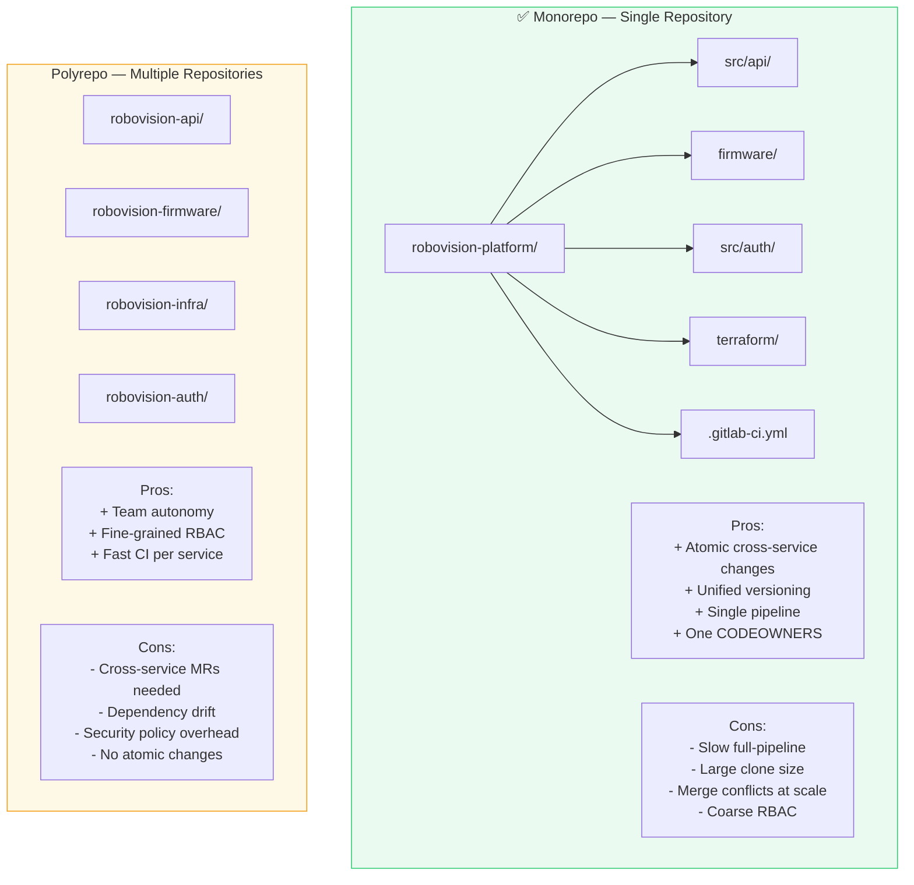
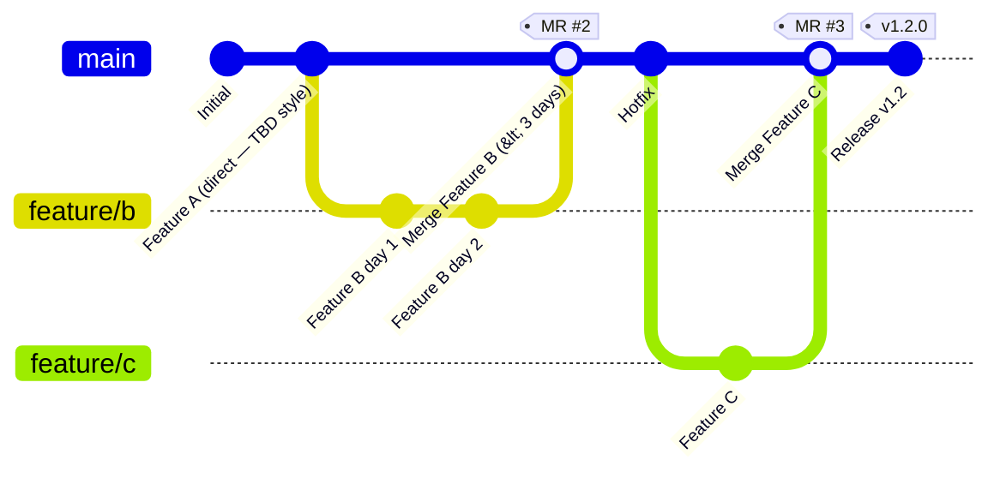
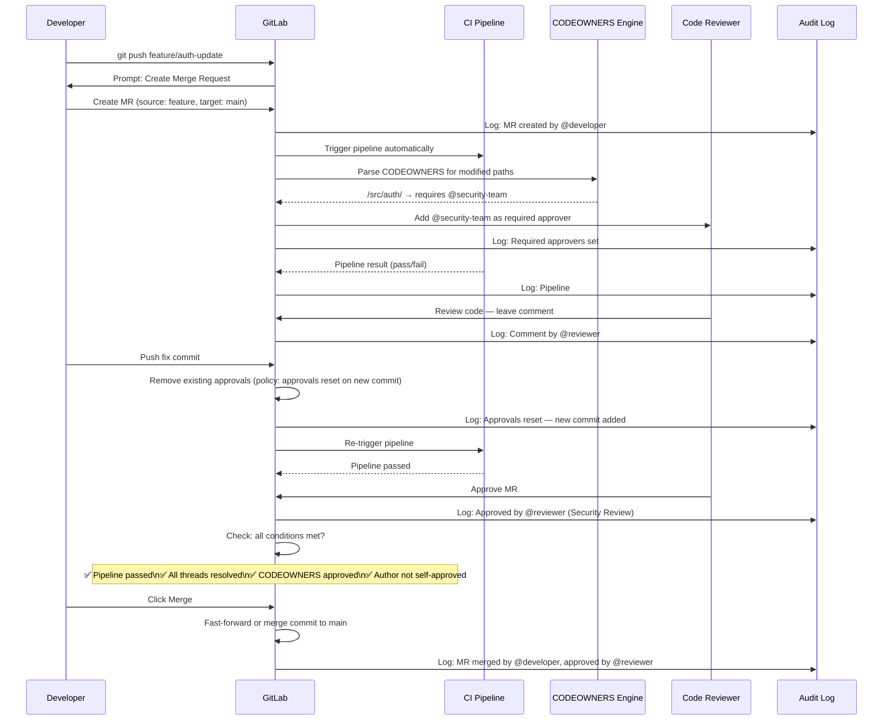
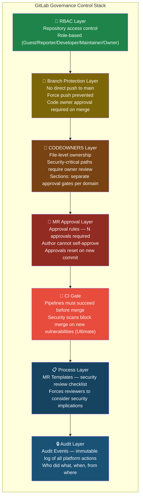
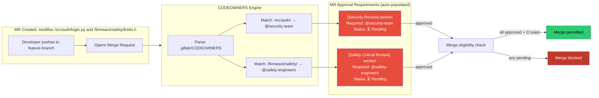
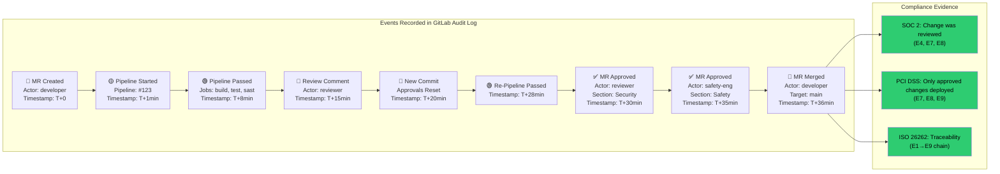
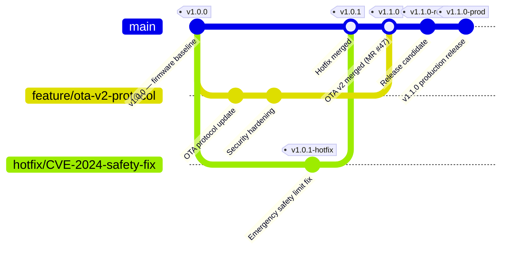

# ARCHITECTURE DIAGRAMS — MODULE 4
## Source Control and Governance
### Render at https://mermaid.live

---

## Diagram 1: Monorepo vs Polyrepo Trade-off

---

## Diagram 2: Trunk-Based Development vs Git Flow

---

## Diagram 3: GitLab Merge Request — Internal Governance Flow

---

## Diagram 4: Governance Control Stack

---

## Diagram 5: CODEOWNERS — How It Works

---

## Diagram 6: Protected Branch Flow

```mermaid
stateDiagram-v2
    [*] --> CodeOnFeatureBranch : Developer creates feature branch

    CodeOnFeatureBranch --> OpenMR : git push + Create MR
    
    OpenMR --> PipelineRunning : CI triggers automatically

    PipelineRunning --> PipelinePassed : All jobs succeed
    PipelineRunning --> PipelineFailed : Any job fails

    PipelineFailed --> FixCode : Developer fixes issue
    FixCode --> PipelineRunning : Pushes fix commit (approvals reset)

    PipelinePassed --> WaitingApprovals : Meets CI requirement

    WaitingApprovals --> AllApproved : Required approvers approve
    WaitingApprovals --> ReviewComment : Reviewer requests changes
    ReviewComment --> FixCode : Developer addresses comments

    AllApproved --> MergeEligible : All conditions met

    MergeEligible --> Merged : Maintainer clicks Merge
    Merged --> [*] : Source branch deleted; audit trail complete

    note right of MergeEligible
        Conditions checked:
        ✅ Pipeline passed
        ✅ All threads resolved
        ✅ CODEOWNERS sections approved
        ✅ Approval rules satisfied
        ✅ Author did not self-approve
    end note
```

---

## Diagram 7: Compliance Audit Trail — What GitLab Records

---

## Diagram 8: Branching Strategy for IoT/Firmware Teams

---

## Usage Notes

- Diagram 3 (MR Governance Flow) is the primary teaching diagram — walk through in detail
- Diagram 4 (Governance Stack) use as a summary after covering all sections
- Diagram 5 (CODEOWNERS mechanics) draw on whiteboard first, then show diagram
- Diagram 7 (Compliance audit trail) use when discussing SOC 2 / PCI DSS in business context
- Diagram 8 (IoT branching) specific to IoT/firmware audience in Module 15 discussion
